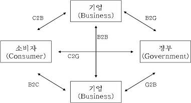

## 1. 전자상거래의 유형
전자상거래의 유형은 B2C, B2B, B2G, C2C, e-마켓플레이스 등으로 나눌 수 있다
   

**B2C(Business to Customer, 기업과 소비자 간의 전자상거래)**
- 소비자를 대상으로 하는 서비스업으로 소비자에게 유 / 무형의 재화를 제공 / 판매 및 중개를 한다
- 일반적으로 사이버 쇼핑몰을 통해 상품을 주문 / 판매 / 대금의 결제 및 광고, 배달 등과 관련된 기업과 소비자 간의 전자상거래이다

**B2B(Business to Business, 기업 간의 전자상거래)**
- 특정 기업 간의 **CALS** 및 **EDI를 통한 수주**, 구매, 조달 및 납품 등과 관련된 기업 간의 전자상거래이다
- 각종 문서 / 양식 / 교환 / 처리 비용의 절감, 내부 업무처리 방법 및 내용에 대한 표준화와 운영비용 절감, 마케팅 및 영업 채널의 확대에 따른 이윤의 증대 등의 효과가 있다

**B2G(Business to Government, 기업과 정부 간의 전자상거래)**
- 조달, 행정, 인증 등과 관련된 기업과 정부 간의 전자상거래이다
- 전자정부 구현을 위한 인프라 구축, 주요 공공 정보자료에 대한 문서 공증에 따른 정보보호 효과 및 전자공개 입찰을 통한 투명 행정 구현 등의 효과가 있다

**C2C(Customer to Customer, 소비자 간의 전자상거래)**
- 소비자 간의 일대일 거래가 이뤄지는 것을 뜻하는 것으로 소비자가 상품 구매자와 공급자가 되는 것이다
- 활발한 커뮤니티를 중심으로 경매 방식이 접목되어서 벼룩시장의 중고품에 대한 개인 경매 혹은 물물교환과 같은 소비자 간의 전자상거래이다

**e-마켓플레이스(e-Marketplace)**
- 인터넷 상에서 다수의 기업 간, 공급과 수요 간에 유발되는 비즈니스 거래를 총칭하는 가상시장을 의마한다
- 제품, 서비스, 정보 등 기업의 구매 및 판매와 관련된 모든 서비스를 제공하고, 공급 기업과 구매 기업을 연결시켜서 통합하는 혁신적인 개념으로서, B2B 전자상거래 커뮤니티를 의미한다